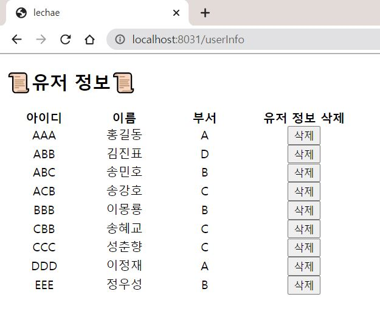

# spring_project
스프링 프레임워크 공부를 위한 연습용 프로젝트

- 기간: 2020.11.24 ~   
- 참고한 책: [코드로 배우는 스프링 웹 프로젝트](https://www.aladin.co.kr/shop/wproduct.aspx?ItemId=166270352)

 

# 주간보고
## 1주차 (2020.11.24 ~ 2020.11.29)
- Java 11.0.9 설치
- Eclipse(jee-2020-09-R) 및 STS(Spring Tool Suite) 설치
- Tomcat 9 설치 및 Eclipse 연동
- mariaDB(10.2.36) & workbench(8.0.22) 설치
- [settingweb](./settingweb) 프로젝트에 DB 연동하여 서버로 확인

  

- [개발 환경 구축 중 나온 이슈들](./docs/[1week]how-to-resolve-setting-issues.md "개발 환경 구축 중 나온 이슈들")

 
 

## 2주차 (2020.11.30 ~ 2020.12.6)
- [API 가이드 문서 작성](./docs/[week2]SW_활용률_API_사용_가이드.pdf)
- 참고 문서
    - [LINE Pay 기술 연동 가이드](https://pay.line.me/file/guidebook/technicallinking/LINE_Pay_Technical_Linking_Guide_for_Normal_Merchant_v1.0.1_ko.pdf)
    - [RESTful API 설계 가이드](https://sanghaklee.tistory.com/57)
- Question
  - 요청 메세지가 json이 아닌 url인 경우 어떻게 작성해야 할까요? (어떻게 작성해야할 지 몰라 요청 URL로 작성했습니다.)
  
    

  - **ANSWER**: API 가이드는 유연하게 작성하기 때문에 Content-Type에 꼭 맞게 작성하지 않아도 된다. 결과 화면이 json이라면 Required에 사진과 같이 작성 가능하다.

- Quiz
  - pathVariable
    
    {}(중괄호)를 사용해 URL 뒤에 변수처럼 적어준 뒤 @pathVariable 어노테이션 뒤에 name 속성의 값으로 {} 안에 적은 변수명을 넣어서 사용한다. 그 이후 자료형과 변수명을 바로 뒤에 선언해주면 된다. restAPI에서 많이 사용한다.

  - JSON

    JavaScript Object Notation라는 의미의 축약어로 데이터를 저장하거나 전송할 때 많이 사용되는 경량의 DATA 교환 형식이다. 사람과 기계 모두가 이해하기 쉽고 용량이 작기 때문에 XML을 대체하여 데이터 전송 등에 자주 사용된다.

  - HTTP

     HTML 문서와 같은 리소스들을 가져올 수 있도록 해주는 프로토콜이다. 웹에서 이루어지는 모든 데이터 교환의 기초이며, 클라이언트-서버 프로토콜이다.

 
 

## 3주차 (2020.12.7 ~ 2020.12.13)
- spring boot 환경 구축

  

- 간단한 API 만들기 + SQL 작성
  - spring boot 프로젝트([settingweb_boot](./settingweb_boot))에 myBatis, hikariCP(JDBC Connection Pool)로 mariaDB 연동하여 RestController API 완성
  
  1. 월별 접속자 수
      - sql

        

      - 결과 화면

        

  1. 일자별 접속자 수
      - sql

        

      - 결과 화면
      
        

  1. 평균 하루 로그인 수
      - sql

        

      - 결과 화면

              

  1. 휴일을 제외한 로그인 수
      - sql

        

      - 결과 화면
      
        

  1. 부서별 월별 로그인 수
      - sql

        

      - 결과 화면

          

- 이슈 사항
  - [Eclipse Error: Could not initialize class](https://github.com/lechae/spring_project/issues/1)

- 참고 문서
  - mariaDB 연동
    - [Spring Boot DataBase 연동하기](https://goddaehee.tistory.com/205?category=367461)
    - [spring + hikariCP datasource 설정하기](https://oingdaddy.tistory.com/13)

 
 

## 4주차 (2020.12.14 ~ 2020.12.20)
- VO 정리
  - Before
    - 각각의 모델 안에 중복 변수가 많음
    - visitorsMonthVo - `resultCode`, `totalCnt`, `year`, `month`
    - visitorsDateVo - `resultCode`, `totalCnt`, `year`, `month`, date
    - loginVo - `resultCode`, `totalCnt`
    - loginDeptAndMonthVo - `resultCode`, `totalCnt`, department, `year`, `month`
  - After
    - 조회 조건과 결과로 나누어 VO 생성
    - `@JsonInclude` annotation을 사용하여 필요없는 변수는 json 출력하지 않음
    - infoVo - year, month, date, department
    - resultVo - resultCode, resultString, totalCnt, avgNum, info(infoVo)
- 에러 메세지 추가
  - 필수 파라미터 정보가 없을 때, 에러 메세지 확인할 수 있도록 추가
  - Source

    

  - 결과 화면

    

  - ▶ 추가 구현 필요 ◀

    에러가 발생하면 Error Page(jsp로 구현할 예정)로 매핑될 수 있도록 구현
    1. Whitelabel Error Page 사용
    1. 커스텀 Error Page 사용

    참고: [SpringBoot 에러 페이지 설정](https://goddaehee.tistory.com/214)

- API 기능 추가
  - 사용자 API 사용을 위해 `userVo(userId, name, dept)` 추가
  - 사용자 정보 조회
    - sql

      

    - 결과 화면

        

  - 사용자 정보 추가
    - 사용자 등록 페이지를 만들어 추가할 수도 있도록 구현함
      
    - sql

      

    - 결과 화면

        

       

  - 사용자 정보 삭제
    - sql

      

    - 결과 화면

        

        
      ⬆사용자 정보가 requestInfo 테이블에 등록된 경우, 삭제할 수 없음⬆

- API 사용 가이드 업데이트
  - 3-4주차에 개발한 내용을 실제 사용자가 이해할 수 있도록 문서 작성
  - 문서: [SW 활용률 API 사용 가이드](./docs/[week3-4]SW_활용률_API_사용_가이드.pdf)