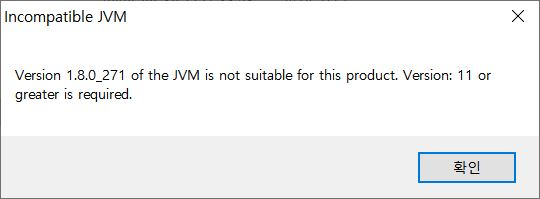
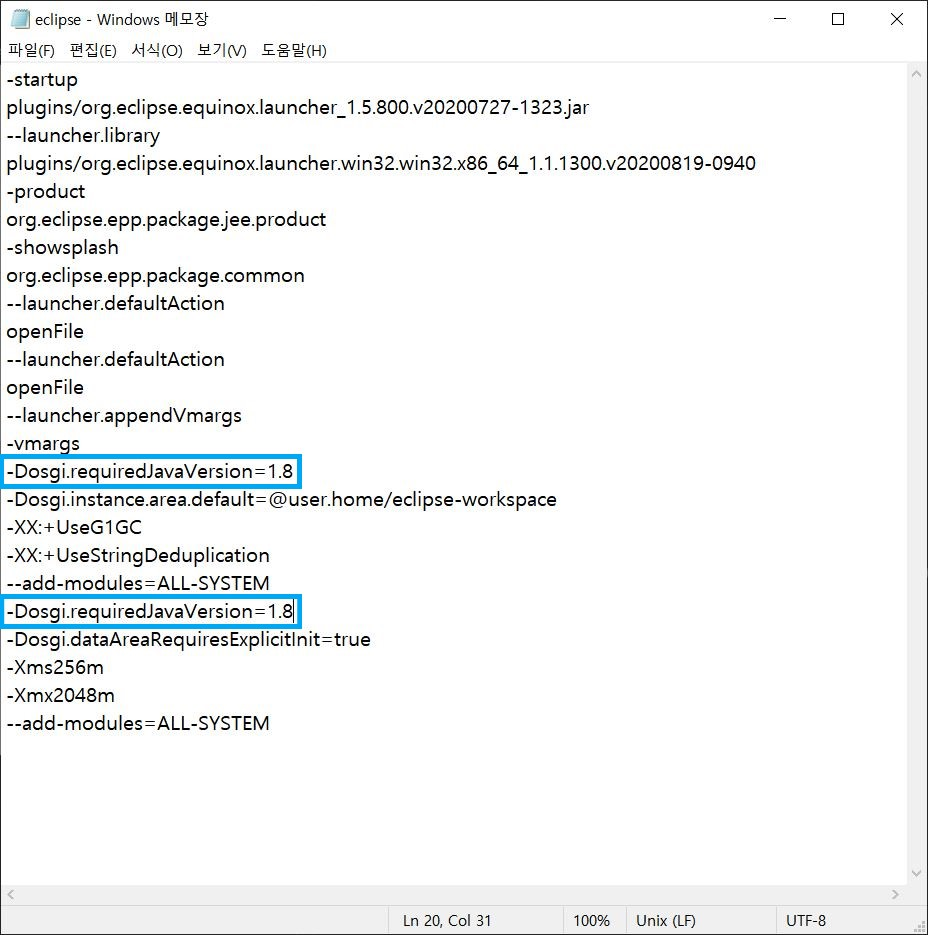
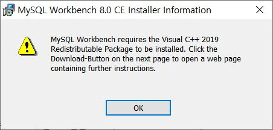
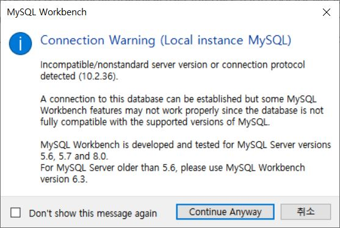
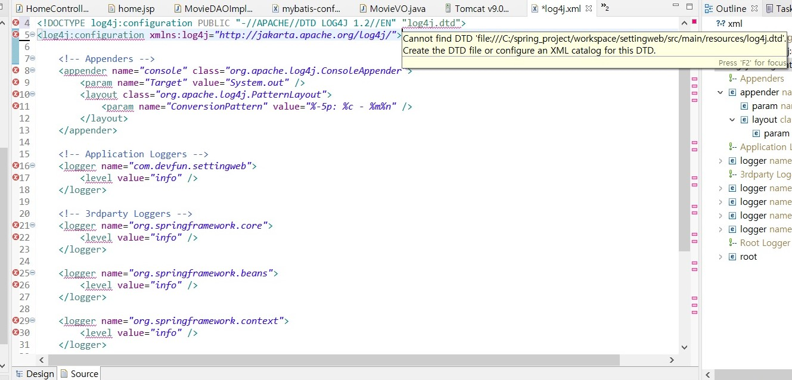
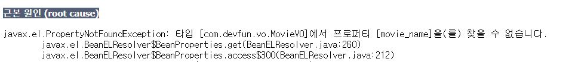
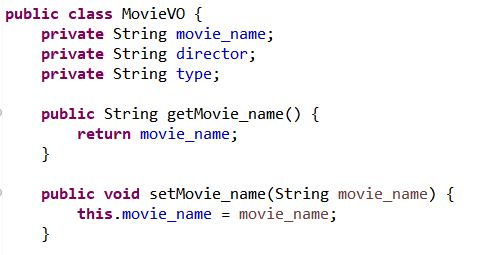
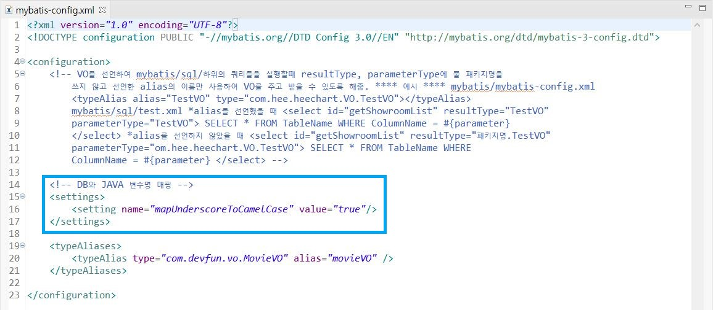
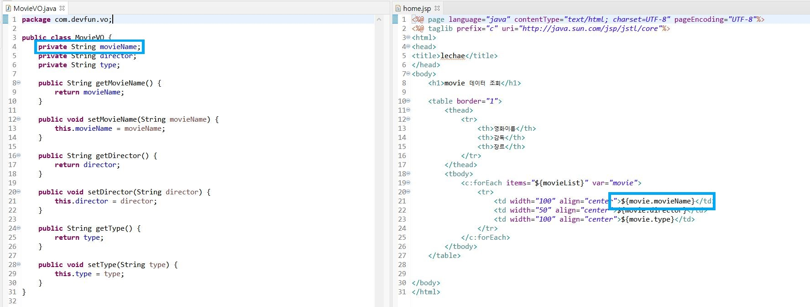

# Issues List
- [Elipse 실행 오류](#Elipse-실행-오류)
- [workbench 설치 오류](#workbench-설치-오류)
- [workbench에서 mariaDB connection 경고](#workbench에서-mariaDB-connection-경고)
- [log4j.xml 파일 오류](#log4j.xml-파일-오류)
- [mybatis에서 _(언더바) 있는 컬럼명 제대로 읽어오기](#mybatis에서-_(언더바)-있는-컬럼명-제대로-읽어오기)

</br>

# Issues
## Elipse 실행 오류
- 1.8.0 버전을 먼저 설치했지만 Eclipse 최신 버전에서 지원해주지 않음

  
- 해결방법 1: 현재 version 삭제 후 11 version 이상으로 재설치하기([참고](https://minstar0410.tistory.com/2))
- 해결방법 2: elipse.ini 파일에서 아래 사진과 같이 자바 버전 낮춰주기

    
- **해결방법 1**로 해결함! 해결방법 2도 실행은 잘 되지만 이미 이클립스 오류(서버 및 프로젝트 로딩이 갑자기 안됨..)로 구글링에 지친 관계로 초기 세팅을 변경하고 싶지 않았다.. :)

</br>

## workbench 설치 오류
- workbench 설치 실행 파일을 실행했으나 아래 사진과 같이 Visual C++ 2019가 필요하여 다운로드 되지 않음

  
- 해결 방법: [여기](https://support.microsoft.com/ko-kr/help/2977003/the-latest-supported-visual-c-downloads)에서 vistual c++ 2019 설치 후 재실행하기([참고](https://musclebear.tistory.com/115))

</br>

## workbench에서 mariaDB connection 경고
- workbench에서 mariaDB를 실행할 때 아래 사진과 같이 경고문이 뜬다면 **무시**해도 됨

  
  (workbench가 Oracle 제품이기에 mariaDB를 공식적으로 지원해주지 않기에 경고문이 뜸)

</br>

## log4j.xml 파일 오류
- log4j.dtd를 찾을 수 없다고 나오며 log4j.xml 파일 전체를 읽을 수 없음

  
- 해결 방법: DTD 파일의 경로를 웹의 절대 경로로 지정한 형태로 바꿔주기([참고](https://blog.itpaper.co.kr/spring-log4j-error/))
  ```xml
  <?xml version="1.0" encoding="UTF-8"?>
  <!DOCTYPE log4j:configuration SYSTEM "http://logging.apache.org/log4j/1.2/apidocs/org/apache/log4j/xml/doc-files/log4j.dtd">
  <log4j:configuration xmlns:log4j="http://jakarta.apache.org/log4j/">
  ```
  log4j.xml에서 상단 3줄만 변경해주면 됨

</br>

## mybatis에서 _(언더바) 있는 컬럼명 제대로 읽어오기
- movie 테이블에서 _(언더바)가 있는 변수명을 읽지 못해 실행이 제대로 되지 않음

  
- movieVO.java와 home.jsp에서 DB와 같게 설정해줘도 찾지 못함

  

- 해결 방법: mybatis 설정 중 **mapUnderscoreToCamelCase**을 사용하여 변수명 변경하기([참고](https://jmseo.tistory.com/32))
  
  - 적용하면 DB 컬럼명이 movie_name일 경우, VO에서 movieName 와 매핑됨
  - mybatis-config.xml에 mapUnderscoreToCamelCase 추가
 
  
  - MovieVO.java와 home.jsp에서 변수명 movieName으로 변경
 
  

